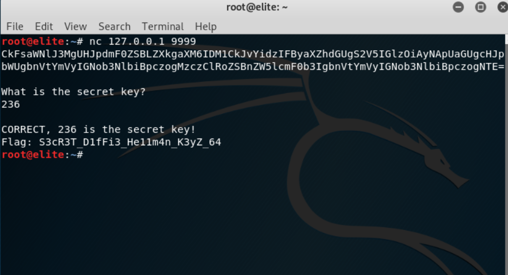

Email: emilybest878@hotmail.com
# Something Diffie-rent

## Flag
Flag: `S3cR3T_D1fFi3_He11m4n_K3yZ_64`
## Briefing
We recently found this TCP service on `<ip>` port number `<portnumber>` which asks for a secret key. There appears to be an encoded message, but our agents couldn’t work out what it meant.  Can you decode it and work out the secret key to access the flag?

By Emily

#### Optional Hint:
Research methods of exchanging cyptographic keys over a public channel securely.

## Infrastructure
* Programming Language: Python
* Host the Python File (The TCP port it is hosted on can be changed within the script, it is currently set to 9999 for example purposes)
* Python Modules Required:
  * socketserver
  * random
  * base64
## Risks
To the best of my knowledge, there are no risks associated with this program.
## Walkthrough
1. The user connects to the service with `nc <ip> <port>`:
 
1. The user will now need to decode the base64 presented to them in step one. The command `echo <base64> | base64 -d` can be used to complete this step:
 
 However, the user may choose to use another tool which can decode base64
1. Using the numbers which have been retrieved from the base64, the user will carry out Diffie Hellman key exchange, where a=35, b=24, n=373, and g=51
```
 The user would first work out Alice’s public key:
 PublicKeyA = g^a mod n
 PublicKeyA = 51^35 mod 373
 PublicKeyA = 52
 
 The user would then work out Bob’s public key:
 PublicKeyB = g^b mod n
 PublicKeyB = 51^24 mod 373
 PublicKeyB = 169
 
 Next the user would work out the value of the key A and key B 
 (these should produce the same value and thus are the value of the secret key)
 Ka = PublicKeyB^a mod n
 Ka = 169^35 mod 373
 Ka = 236
 
 Kb = PublicKeyA^b mod n
 Kb = 52^24 mod 373
 Kb = 236
 Secret Key = 236
 
  (Note: the key will not always equal 236 as the numbers used in the calculation are randomised, 
  and the Base64 changes accordingly.)
```
4. The user will now enter the value of the secret key into the terminal (in this case 236), and the flag is output if the value entered is correct:

Flag: `S3cR3T_D1fFi3_He11m4n_K3yZ_64`
